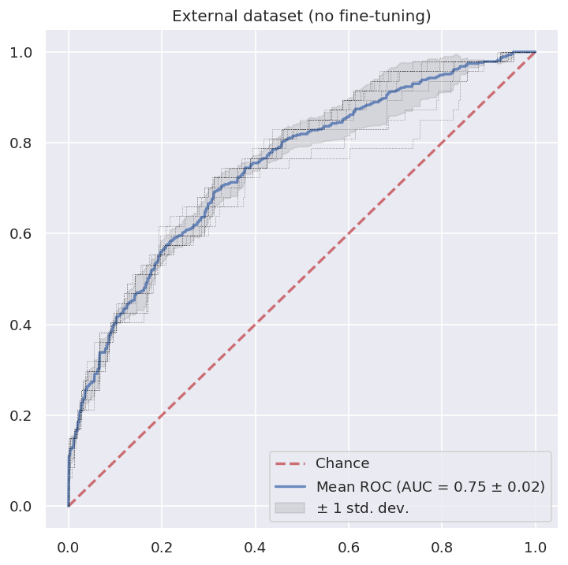

# COVID3D

Recently deployed COVID3D on a recently-released dataset MosMedData. The labels in this dataset do not match perfectly with our model as their "negatives" are of CT scans absent of all viral pneumonia. Nonetheless, we agnostically perform inference and generate logits. Here we treat "CT-0" as a negative label (CT- pneumonia) and "CT3+4" as a positive label.

Update: May 15, 2020. Code will be uploaded shortly.

