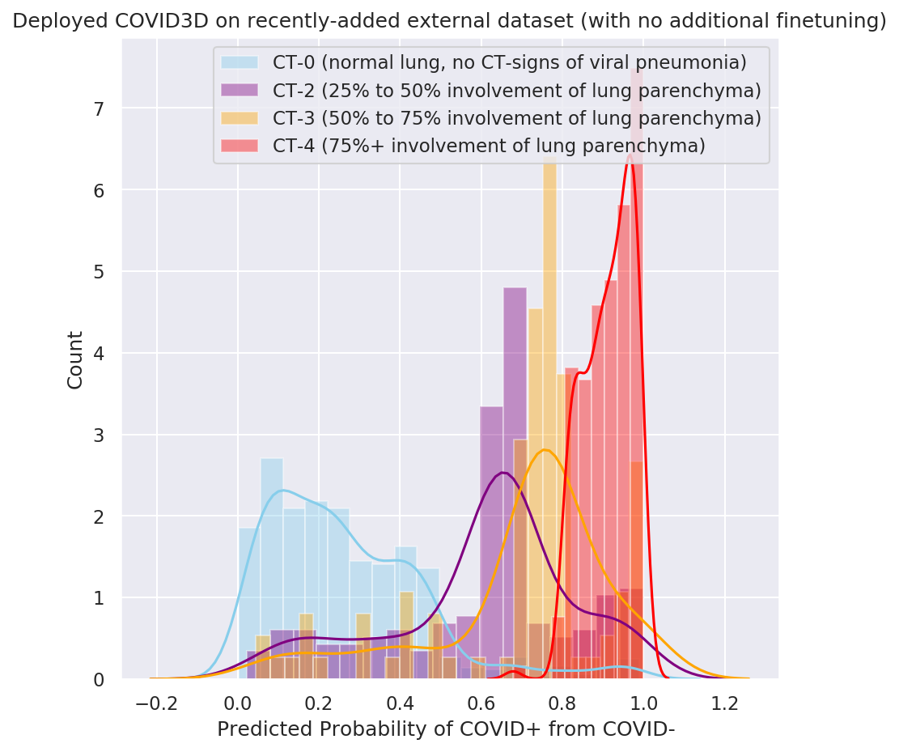

# COVID3D

Recently deployed COVID3D on a recently-released dataset MosMedData. The labels in this dataset do not match perfectly with our model as their "negatives" are of CT scans absent of all viral pneumonia. Nonetheless, we agnostically perform inference and generate logits. The histogram of the predicted probabilities of COVID+ is shown and are color-coded by the labels. We see clear separation between the various degrees of COVID state.  

Update: May 15, 2020. Code will be uploaded shortly.

Please cite:
Edward H. Lee, Jiangdian Song, Hongmei Wang, Jimmy Zheng, Michelle Han, 
Jayne Seekins, S. Simon Wong, Kexue Deng, and Kristen W. Yeom. Classification and tracking of COVID-19 from
admission to discharge using chest CT. Under review.

